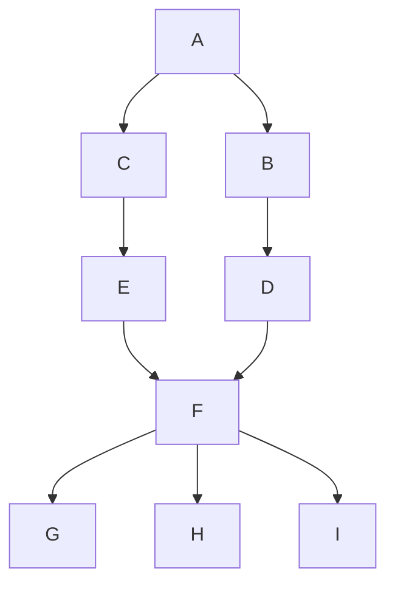

# Markdown语法（简洁版）

[TOC]

概述
-

### 前言
1、易读易写


### 兼容HTML
1、看不懂


### 特殊字符自动转换
1、特殊字符 **<**, **&**


## 区块元素

### 段落和换行


### 标题

#### 1、类setext
```
== 和 -- 可以一个 可以 多个
xxx (一级标题)
=

xxx（二级标题）
----

```

#### 2、atx

类 Atx 形式则是在行首插入 1 到 6 个 # ，对应到标题 1 到 6 阶，例如：
```
# 这是H1
## 这是H2
###### 这是H6
```

### 区块引用 blockquotes
> test1
> test2

区块引用可以嵌套（例如：引用内的引用），只要根据层次加上不同数量的 `>` ：

```
>test2.2
>
>>test7
>
>test8
```

>test2.2
>
>>test7
>
>test8

Markdown 也允许你偷懒只在整个段落的第一行最前面加上     `>`：

```
> test4
test5
> >test6
```

> test4
> test5
>
> > test6

### 列表

无序列表使用星号、加号或是减号作为列表标记

```
* test1
* test2
* test3
等同于
+ test1
+ test2
+ test3
等同于
- test1
- test2
- test3
```

* test1
* test2
* test3
等同于
+ test1
+ test2
+ test3
等同于
- test1
- test2
- test3

有序列表则使用数字接着一个英文句点：

```
1. test1
2. test2
3. test3

等同于
1. test1
1. test2
1. test3

对比
3.  test1
1.  test2
9.  test3

```

1. test1
2. test2
3. test3

等同于
1. test1
1. test2
1. test3

对比
3.  test1
1.  test2
9.  test3

代办列表

```
- [ ] 不勾选
- [x] 勾选
```

- [ ] 不勾选
- [X] 勾选

### 代码区块


要在 Markdown 中建立代码区块很简单，只要简单地缩进 4 个空格或是 1 个制表符就可以，例如，下面的输入：
```java
// 代码块
public static void main(String[] args){
    System.out.println("HelloWorld");    
}
```

### 分隔线

```
***
* * *
***********************
- -- ----- -- --- -- --
___________
```


***
* * *
***********************
- -- ----- -- --- -- --
___________


## 区段元素
### 链接 & 图片

> 行内式：方括号显示说明，圆括号内显示网址，
> > [百度](http://www.baidu.com)
> >
> > 


> > aaa

> 参考式:  第一个方括号显示说明,第二个填入标记
> > [百度][baidu]
> > [test][a]
> > [test][A]


>在文件任意处定义标记的链接
[baidu]: www.baidu.com
[a]: www.baidu.com


### 强调
\*test\* ---> *test*
\_test\_ ---> _test_
\*\*test\*\* ---> **test**
\_\_test\_\_ ---> __test__
**注意：**
a \_test\_ a  ---> a _test_ a
a\_test\_a  ---> a_test_a

### 代码

如果要标记一小段行内代码，你可以用反引号把它包起来   \` 
\`a\` ---> `a`

如果要在代码区段内插入反引号，你可以用多个反引号来开启和结束代码区段：
`` System.out.println( ` ); ``

代码区段的起始和结束端都可以放入一个空白，起始端后面一个，结束端前面一个，这样你就可以在区段的一开始就插入反引号：
 `` `test` ``


 ## 其他
 ### 自动连接


### 流程图
Markdown 编辑器已支持绘制流程图、时序图和甘特图。通过 mermaid 实现图形的插入

1、直接手动插入



2、直接调用一个网站的接口，自动生成

 parse -> execute;
   main -> init;
   main -> cleanup;
   execute -> make_string;
   execute -> printf
   init -> make_string;
   main -> printf;
   execute -> compare;
 }
'/>


### 时序图

1、直接调用一个网站的接口，自动生成


