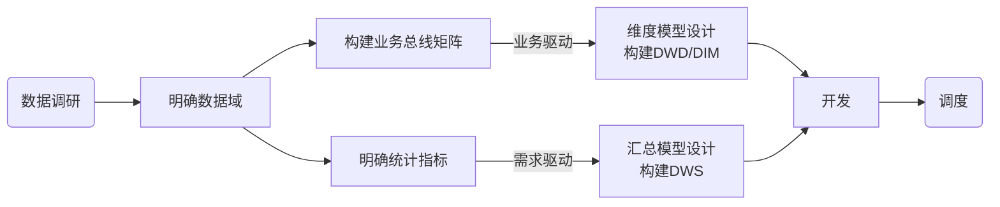

[TOC]

# 大数据


## 数仓 Data Warehouse


### 数仓概念

#### 数仓简介：

数据仓库，存储数据, 管理数据，提供查询/分析等后续业务

数据仓库是一个为数据分析而设计的企业级数据管理系统。数据仓库可集中、整合多个信息源的大量数据，借助数据仓库的分析能力，企业可从数据中获得宝贵的信息进而改进决策。同时，随着时间的推移，数据仓库中积累的大量历史数据对于数据科学家和业务分析师也是十分宝贵的。


#### 输入数据分类： 

业务数据、用户行为数据、爬虫数据


#### 整体流程：

1. 数据采集：
   * 文件数据采集:  flume   (用户行为数据)
   * 数据库数据采集：DataX （业务数据）
2. 数据分析：数据过滤、清洗、聚合、统计
   * ods 贴源层
   * dwd 明细层
   * dws 数据轻度汇总层， 预聚合
   * ads 热数据层，统计最终指标
3. 数据输出：
   * 数据可视化报表
   * 用户画像
   * 推荐系统
   * 机器学习


## 数仓建模概述

### 数仓仓库建模的意义

数据建模： 将数据有序的组织和存储，让数据能得到高性能、低成本、高效率、高质量的使用

* 高性能：快速查询需要的数据
* 低成本：减少重复计算，实现计算结果复用，降低计算成本
* 高效率：提高数据使用效率
* 高质量：防止数据统计口径的混乱，减少计算错误的可能性

### 数仓建模方法论

ER模型， 维度模型

#### ER模型：

Entity - Relationship ，实体关系模型。

使用实体关系模型来描述业务， 并用规范化的方式表示出来，在范式理论上符合3NF。

实体关系：将复杂数据抽象为——**实体**和**关系**

数据库规范化范式：

* 第一范式：属性不可切割 
* 第二范式：不能存在部分函数依赖
* 第三范式：不能存在传递函数依赖

#### 维度模型：

将复杂业务通过**事实**和**维度**两个概念进行描述。

* 事实对应业务过程。（下单，下载，）

* 维度对应业务过程发生时所处的环境。（下单时的地区，设备信息，ip信息）


## 维度建模理论之事实表

#### 事实表概述

事实表作为数仓建模的核心，紧紧围绕着业务过程来设计。其包含与该业务过程有关的维度引用（维度表外键），以及该业务过程的度量（可累加的数字类型的字段）

#### 事实表特点

事实表通常，比较“细长”，即列较少，但行较多， 且行的增速块。

#### 事实表分类

事实表有三种类型：分别是，事务事实表、周期快照事实表、累积快照事实表。


### 事务事实表

用来记录各业务过程，保存的是各业务过程的原子操作事件，即最细烈度的操作时间。*粒度是指事实表中一行数据所表达的业务细节程度*。

事务型事实表，可用于分析与个业务过程相关的各项统计指标，由于其保存了最细粒度的记录，可以提供最大限度的灵活性，可以支持**无法预期的各种细节层次**的统计需求。*dwd表，业务明细表，保留细粒度数据*


**设计流程**：

业务过程声明  —> 声明粒度 —> 确认维度 —> 确认事实

1. 业务过程：下单/下载等，通常一个业务过程对应一张事务型事实表
2. 声明粒度：尽可能选择最细粒度，以此应对各种细节程度的需求。
3. 确定维度：选择业务过程相关的环境信息，维度越丰富，能支持的指标越多。比如时间维度/地区维度/用户维度
4. 确定事实：“事实”，指每个业务过程的度量值（通常是可累加的数字类型值，次数/个数/金额）

 

### 周期快照事实表

周期快照事实表一般以具有规律性的、可预见的时间间隔来记录事实，主要用户分析一些存量型（比如商品库存、账户余额）或者状态型（空气温度，行驶速度，下载传输速度）指标。

对于存量型指标，业务系统中通常会计算并保存最新结果，所以定期同步一份全量数据到数据仓库，构建周期型快照事实表，就可以比较方便的实现统计需求，无需对事务事实表中大量数据进行历史记录进行聚合操作。

对于状态型指标，由于它们的值往往是连续的，无法捕获其变动的原子操作，所以无法用事务型事实表统计。只能定期对其进行采样，构建周期型快照事实表。

**设计流程**：

确定粒度 —> 确认事实

1. 粒度 = 采样周期 + 维度
   * 采样周期通常选择每日/周/月
   * 维度，可以根据统计指标决定，（比如指标是统计仓库中商品库存，则可以确定为仓库和商品）
2. 确认事实：也是根据统计指标决定，具体的度量值


### 事实类型（度量类型）

事实类型是指度量值的类型，而非事实表的类型。事实（度量值），共分为三类，分别是可加事实，半可加事实和不可加事实。

* 可加事实：按照与事实表相关的所有维度进行累加。（比如总金额，用户登录次数）
* 半可加事实：只能按照与事实表相关的一部分维度进行累加。（比如商品库存，不能按时间维度累加，可以按商品维度累加）
* 不可加事实：完全不具备可加性，比如比率型事实。不可加事实通常需要转换为可加事实，比如比率可以转换为分子和分母

### 累积型快照事实表

累计快照事实表，是基于一个业务流程中多个关键业务过程联合处理而构建的事实表，比如交易流程中的下单、支付、发货、确认收货业务过程。

累计快照型事实表，通常具有多个日期字段，每个日期对应业务流程中的一个关键业务过程（里程碑）。

**设计流程**：

1. 选择业务过程：选择一个业务流程中，需要关联分析的多个关键业务过程，多个业务过程对应一张累计型快照事实表
2. 声明粒度：精确定义每行数据表示的是什么，尽量选择最小粒度
3. 确认维度：选择与各个业务相关的维度，需要注意的是，每个业务过程均需要一个日期维度
4. 确认事实：选择各业务过程的度量值

## 维度建模理论之维度表

维度表是维度建模的基础和灵魂。事实表紧紧围绕业务过程进行设计，而维度表则围绕业务过程所处的环境进行设计。维度表主要包含一个主键和各种维度字段，维度字段称为维度属性。


### 维度表设计步骤

1. 确定维度： 

   在设计事实表时，一般已经确定与每个事实表相关的维度，多个事实表与同一维度都相关的时候，需要保证维度的唯一性，只需创建一张维度表。此外，如果某些维度表的维度属性很少，只有个名称，则可以不创建维度表，而把该表的维度属性直接增加到与之相关的事实表中，这个操作称为**维度退化**。

2. 确定主维表和相关维表：均指业务系统中与某维度相关的表。例如业务系统中，与商品相关的表，有sku，spu, 分类等，其中sku就是商品维度的主维表，其余则是商品维度的相关维表。维表的粒度通常与主维表相同。

3. 确定维度属性：维度属性主要来自于业务系统中与该维度对应主维表和相关维表

   * 尽可能生成丰富的维度属性
   * 尽量不使用编码，而使用明确的文字说明，一般编码和文字共存
   * 尽量沉淀出通用的维度属性（有些维度需要进行比较负责的逻辑处理，例如需要读个字段拼接，为避免重复处理，可将其沉淀到维度表之中）


### 维度设计要点

规范化与反规范化

星型模型和雪花模型


### 维度变化

维度属性通常不是静态的，而是会随着时间变化的，数据仓库的一个重要特点就是反映历史的变化，所以如何保存维度的历史状态时维度设计的重要工作之一。保存维度数据的历史状态，通常用两种做法，全量快照表和拉链表

**全量快照表**：每天保存一份全量的维度数据。简单有效维护成本低/浪费存储空间

**拉链表**：高效保存，维度历史状态。记录每条信息的生命周期（有一定数据量，而且变化比例不高的）。


### 多值维度

如果事实表中一条记录再某个维度表中有多条记录与之对应，则称为多值维度。

解决方案：

1. 降低事实表粒度（一般使用）
2. 再事实表中用多个字段保存多个维度值（一般适用于多值维度个数固定的情况）


### 多值属性

维表中某个属性，同时有多个值，称为多值属性。

解决方案：

1.  将多值属性放到一个字段，以kv键值对的形式存储
2. 将多值属性放到多个字段，每个字段对应一个属性


## 数据仓库设计

### 数仓分层规划

* ODS 原始数据层：存放未经处理的原始数据，结构上与源系统保持一致
* DWD明细数据层：基于维度建模理论进行构建，存放维度模型中的事实表，保存各业务过程最细粒度的操作记录
* DWS汇总数据层：基于上层指标需求，以分析的主题对象作为建模驱动，构建公共统计粒度的汇总表
* DIM公共维度层：基于维度建模理论进行构建，存放维度模型中的维度表、保存一致性维度信息
* ADS数据应用层：存放各项统计指标结果


### 数据仓库构建流程




#### 数据调研

数据调研，主要分为业务调研和需求分析

1. 业务调研：熟悉业务流程，熟悉业务数据
2. 需求分析：明确业务过程和维度

#### 明确数据域

数仓模型设计除了横向的分层外，通常也需要根据业务情况进行纵向划分数据域。便于数据的管理和应用。

#### 构建业务总线矩阵

> 业务过程声明  —> 声明粒度 —> 确认维度 —> 确认事实

| 数据域 | 业务过程 | 粒度 | 用户维度 | 商品维度 | 地区维度 | 订单类型维度 | 度量值          |
| ------ | -------- | ---- | -------- | -------- | -------- | ------------ | --------------- |
| 交易域 | 加购物车 |      | √        | √        |          |              | 商品数量        |
| 交易域 | 下单     |      | √        | √        |          | √            | 下单数/订单金额 |
| 交易域 | 支付     |      | √        | √        |          | √            | 下单数/支付金额 |
| 用户域 | 注册     |      | √        |          | √        |              | 次数            |
| 用户域 | 登录     |      | √        |          | √        |              | 次数            |

一个业务过程对应维度模型中一张**事务型事实表**，一个维度则对应维度模型中的一张维度表。

所以构建业务总线矩阵的过程，就是设计维度模型的过程。但是通常只包含事务型事实表，另外两种类型的事实表需要单独设计。

#### 明确统计指标

指标定义标准化。所有指标定义，遵循一套标准。

1. 原子指标：基于某一**业务过程**和**度量值**， 进行**聚合逻辑**
2. 派生指标：基于原子指标（派生指标=原子指标+统计周期+业务限定(where)+统计粒度(分组)）
3. 衍生指标：是在一个或多个派生指标的基础上，通过各种逻辑运算符合而成。比如比率/比例等类型的指标。


#### 维度模型设计

按业务总线矩阵设计维度模型，事实表存在DWD, 维度表存在DIM层

#### 汇总模型设计

汇总表与派生指标的对应关系是：一张汇总表通常包含业务过程相同、统计周期相同、统计粒度相同的多个派生指标。


> 比如之前接入的，公司论坛的用户行为数据接入
>
> 业务事务型事实表：用户注册、用户登录、用户发帖、用户评论、用户浏览页面、用户搜索
>
> 快照型事实表，每日用户注册数量，累计数量，登录数量，活跃数量，发帖评论数量等，
>
> 对应维度：
>
> 注册登录，用户信息/时间/IP/系统/进入渠道等。。。基础信息
>
> 发帖评论，帖子板块，帖子id,等
>
> 浏览记录， 浏览页面id, 帖子id，跳转来源等。。。
>
> 搜索记录，


> 比如之前接入的，应用商店数据
>
> 
>
> 应用上下架等操作：维度有，用户/os/IP/
>
> 用户下载应用
>
> 用户搜索应用
>
> 用户更新应用
>
> 


## 数仓开发


### ODS层设计要点：

1.  ODS 层的表结构依托于业务系统同步过来的数据结构
2. ODS层要保存全部历史数据，所以其要锁格式应选择压缩比较高的，比如gzip
3. ODS层命名规范？： `ods_数据来源_业务_增量/全量标识`

### DIM层设计要点：

1. DIM层的设计依据是维度建模理论，该层存储维度模型的维度表
2. DIM层的数据存储格式为orc 列式存储+ snappy压缩
3. DIM层命名规范：`dim_业务表名_全量/拉链标识`


## 项目需求分析


#### 采集平台

业务数据

用户行为数据

#### 离线需求

用户主题、产品主题、其他业务主题。。。。


#### 实时需求

实时用户、实时产品变化


### 项目框架

#### 技术选型

**考虑因素：**

* 数据量大小：每日数据输入量

* 业务需求：比如只需要离线数据处理，那无需简历实时数仓

* 行业内部经验：常用的框架，方案

* 技术成熟度：用的人多，会的人多

* 开发维护成本：简单易用，贴合业务需求

* 总预算成本：经济/人力成本控制


技术组件


数据采集传输：*Flume*, *Kafka*, *DataX*(全量同步), *Maxwell*(增量同步) , Sqoop，Logstash

数据存储：*MySQL*, *HDFS*, *HBase*, *Redis*, MongoDB(机器学习，爬虫)

数据计算：*Hive*, *Spark*, *Flink*, Storm, Tez

数据查询：*Presto*, Kylin, Impala, Druid, *ClickHouse*, Doris

数据可视化：*Superset*, Echarts, *Sugar*, QuickBI, DataV

任务调度：*DolphinScheduler*, Azkaban, Oozie, Airflow

集群监控：Zabbix, Prometheus(实时监控)

元数据管理：Atlas

权限管理：*Ranger*, Sentry

 


#### 系统数据流程 

...


#### 框架版本选型

**自己部署**

Apache： 组件兼容问题

CDH：一键部署，高版本开始收费

HDP：开源，国内用的少

**云服务**

阿里云EMR

亚马逊云EMR

...


**服务器选型**

物理机

云主机


#### 数据规模


**数据规模估算**

* 每天活跃用户100w, 平均每人100条：100w*100 = 1亿
* 每条日志1k左右，每天1亿条：1亿/1024/1024=100G
* 半年不扩容服务器：100G*180天 = 18T
* 3副本：18T * 3= 54T
* 预留20%~30% Buf = 57T/0.7 = 77T
* 约 8*10T 服务器

数仓分层？数据压缩？


#### 集群资源规划

 生产集群+ 测试集群

组件均衡，资源使用均衡


### 用户行为日志


#### 用户行为日志概述：

日志内容：用户行为信息（操作），环境信息（ip，所处页面）

买点方式：代码买点(前后端)、可视化埋点（配置）、全埋点


#### 用户行为日志内容：

* 页面浏览记录：用户信息/页面信息/时间信息/位置/访问设备/渠道
* 动作记录：用户动作操作
* 曝光记录：曝光对象信息
* 启动记录：启动时间，类型（怎么进来）
* 错误记录：收集错误信息


#### 用户行为日志格式：

约定，通用，易解析的格式 —— json

消息体组成

```json
{
    "统一消息头":{
        "公共信息1":"....",
        "公共信息2":"....",
        "消息类型":"1"
    },
   	"body":[
    	{
			"消息内容":"112233"    
		}
    ]
}
```


### 服务器环境准备

#### 服务器准备

* 操作-系统
* 网络
* 常用工具
* 防火墙关闭
* 用户配置，权限配置
* 磁盘分区，文件夹建立
* hosts映射


#### 云服务器准备

包年包月/按量/抢占临时


#### 编写集群分发脚本

```shell
# 同步目录
rsync -av /opt/module  user@host:/opt/
```

#### SSH免密登录

生成ssh密钥

方法一：交换公钥/私钥

方法二：直接使用同一组密钥

#### JDK

#### 环境变量配置


### 数据采集


#### 数据通道

#### 环境准备


**Hadoop部署**

1. 环境变量配置

2. 配置文件修改

   1. core-site.xml , NameNode地址， hdfs数据目录, 用户配置
   2. hdfs-site.xml :  NameNode的web访问地址 ， 指定副本数，
   3. yarn-site.xml: 指定MR走shuffle, 指定ResourceManager 地址， 环境变量的继承， continer容器大小，nodeManager大小 ， 日志聚集
   4. mapred-side.xml: 程序运行在yarn上， 任务运行记录
   5. workers: 指定hadoop集群有几个节点

3. 集群启动

   1. 格式化NameNode: `hdfs namenode -format`
   2. 起NameNode: `start-dfs.sh`
   3. 启动ResourceManager:  `start-yarn.sh`

4. 多目录配置

   hdfs-site.xml

   dfs.datanode.data.dir: file:///dfs/data1,file:///dfs/data2,file:///dfs/data3,file:///dfs/data4


**数据均衡：**

* 磁盘数据均衡 

  ```shell
  # 生成计划
  hdfs diskbalancer -plan node-01 
  # 执行计划
  hdfs diskbalancer -execute node-01.plan.json
  # 查询任务执行情况
  hdfs diskbalancer -query node-01 
  # 取消任务
  hdfs diskbalancer -cancel node-01 
  ```

* 节点数据均衡

  ```shel
  start-balancer.sh  -threshold 10(比例)
  stop-balancer.sh
  ```


**参数调优**

hdfs-site.xml

```xml
# NameNode工作线程池，处理不同DataNode的并发心跳，以及客户端并发元数据操作 

<property>
	<name>dfs.namenode.handler.count</name>
    <value>10</value>
</property>

20 * log e为底， 集群数量为指数
```

yarn-site.xml

内存使用参数


zookeeper 安装

略

kafka安装

略

flume安装


#### flume 数据采集：

* source:  数据源，用户从数据发生器采集接收数据，source产生数据流，同时会把产生的数据流以Flume的event格式传输到一个或者多个channel。

  * taildir: 实时读取文件数据，支持断点续传

  * avro： flume之间

  * nc

  * exec：不支持断点续传，一般不用

  * spooling: 支持断点，监控文件夹

  * kafka source:  kafka 消费者

* channel：传输通道，短暂的存储容器，将从source处接收到的event格式的数据以队列形式缓存起来，直到它们被sinks消费掉，它在source和sink间起桥梁的作用，channel是一个完整的事务，这一点保证了数据在收发的时候的一致性. 并且它可以和任意数量的source和sink链接。

  * file: 基于磁盘，稳定

  * memory：基于内存，会丢失
  * kafka channel: 比较多
    * 结合source 和sink
    * 只用source
    * 只用sink

* sink: 下沉，用于消费channel传输的数据，将数据源传递到目标源，目标可能是另一个sink，也可能HDFS、HBase，最终将数据存储到集中存储器。
  * hdfs sink
  * kafka sink： kafka 生产者
  * avro


* event：在flume中使用事件作为传输的基本单元。


**flume 配置(从文件到kafka)**

1. 定义组件：

   a1.sources = r1

   a1.channels = c1

2. 配置sources

   a1.sources.r1.type = TAILDIR

   a1.sources.r1.filegroups = f1

   a1.sources.r1.filegroups.f1 = /opt/module/app/log/app.*

   a1.sources.r1.positionFile = /opt/module/flume/taildir_position.json

   a1.sources.r1.interceptors = i1

   a1.sources.r1.interceptors.i1.type =  com.demo.flume.interceptor.ClassName$Builder

3. 配置channels

   a1.channels.c1.type = org.apache.flume.channel.kafka.KafkaChannel

   a1.channels.c1.kafka.bootstrap.servers = node-01:9092,node-02:9092

   a1.channels.c1.kafka.topic = topic_log

   a1.channels.c1.parseAsFlumeEvent = false

4. 配置sinks

   此处不用sink

5. 组装

   a1.sources.r1.channels = c1

启动：

```shell
./flume-gn agent -n al -c conf/ -f job/file_to_kafka.conf -Dflume.root.logger=info,consle
```


**flume 配置(从kafka到hdfs)**


1. 定义组件：

   a1.sources = r1

   a1.channels = c1

   a1.sinks = k1

2. 配置sources

   a1.sources.r1.type = org.apache.flume.source.kafka.KafkaSource

   *一批发送多少数据，多少时间一批*

   a1.sources.r1.batchSize=5000

   a1.sources.r1.batchDurationMillis=2000

   a1.sources.r1.kafka.bootstrap.servers = node-01:9092,node-02:9092

   a1.sources.r1.kafka.topic = topic_log

   a1.sources.r1.kafka.consumer.group.id = group_log

   a1.sources.r1.interceptors = i1

   a1.sources.r1.interceptors.i1.type =  com.demo.flume.interceptor.ClassName$Builder

3. 配置channels

   a1.channels.c1.type = file

   *断点续传 check point*

   a1.channels.c1.checkpointDir=/opt/flume/checkpoint/file1

   *flume多目录存储，dataDirs指向不同磁盘目录，会加快写入速度，增大吞吐量*

   a1.channels.c1.dataDirs=/opt/flume/data/file1

   *默认文件大小， 2G*

   a1.channels.c1.maxFileSize=2146435071

   *最大条数，默认100w条*

   a1.channels.c1.capacity = 1000000

   *如果channel满了，等待数据被sink的时间*

   a1.channels.c1.keep-alive=6

4. 配置sinks

   a1.sinks.k1.type = hdfs

   a1.sinks.k1.hdfs.path=/home/warehouse/database/log/%y-%m-%d/%h

   a1.sinks.k1.hdfs.filePrefix = log

   *round ,滚动时间， valuekey= 时分秒 value=时间值*

   a1.sinks.k1.hdfs.round = false

   合并小文件优化：文件滚动，创建超过多少时间/达到128M/多少条数后

   a1.sinks.k1.hdfs.rollInterval = 3600

   a1.sinks.k1.hdfs.rollSize = 134217728

   a1.sinks.k1.hdfs.rollCount = 0

   控制输出的文件类型：

   a1.sinks.k1.hdfs.fileType = CompressedStream

   a1.sinks.k1.hdfs.codec= gzip

5. 组装

   a1.sources.r1.channels = c1

   a1.sinks.k1.channel=c1


## 电商业务简介


略


### Maxwell使用

#### 简介

实时监控Mysql 的数据变更操作，基于Binlog 将变更数据以json格式发送给kafka等流式数据处理平台


插入数据：

```sql
insert into db1.test values(1, 'username');
>>>>
json 数据：
{
	"database":"db1",
	"table":"test",
	"type":"insert",
	"ts":"1679754143",(时间戳)
	"xid":"1234565",(事务id)
	"commit":"true",
	"data":{
		"id":1,
		"name":"username"
	}
}
```

更新数据：

```sql
update db1.test set name='usernameupdate' where id =1;
>>>>
json 数据：
{
	"database":"db1",
	"table":"test",
	"type":"update",
	"ts":"1679754143",(时间戳)
	"xid":"1234565",(事务id)
	"commit":"true",
	"data":{
		"id":1,
		"name":"usernameupdate"
	},
	"old":{
		"name":"username"
	}
}
```

删除数据：

```sql
delete from db1.test where id =1;
>>>>
json 数据：
{
	"database":"db1",
	"table":"test",
	"type":"delete",
	"ts":"1679754143",(时间戳)
	"xid":"1234565",(事务id)
	"commit":"true",
	"data":{
		"id":1,
		"name":"usernameupdate"
	}
}
```


#### 基础配置

配置mysql

* 启用binlog日志，配置row模式，开启binlog的数据库

* 配置用户，权限


修改Maxwell 配置文件:

```shell
vim config.properties

# 可选配置stdout|file|kafka|kinesis|pubsub|sqs|rabbitmq|redis
producer=kafka
kafka.bootstrap.servers=node-01:9092,node-02:9092
kafka_topic=%{database}_%{table}
# mysql 相关配置
host=node-01
user=mysql_root
password=123456
jdbc_options=useSSL=false&serverTimezone=Asia?Shanghai
```


启停

```shell
# 启动
maxwell --config config.properties --daemon
# 停止
kill -9 pid
```


#### 全量同步

使用Maxwell-bootstrap进行全量同步

```shell 
maxwell-bootstrap --database db1 --table tb1 --config /file/conf/config.properties
```

bootstrap 的数据格式：

> * start/complete 仅用于标识开始结束，没有具体数据
> * insert中包含数据
> * ts时间都一致，是bootstrap 开始时间

```json
{
    "database": "db1",
    "table": "tb1",
    "type": "bootstrap-start",
    "ts": 1450557744,
    "data": {}
}
{
    "database": "db1",
    "table": "tb1",
    "type": "bootstrap-insert",
    "ts": 1450557744,
    "data": {
        "txt": "hello"
    }
}
{
    "database": "db1",
    "table": "tb1",
    "type": "bootstrap-insert",
    "ts": 1450557744,
    "data": {
        "txt": "hello!"
    }
}
{
    "database": "db1",
    "table": "tb1",
    "type": "bootstrap-complete",
    "ts": 1450557744,
    "data": {}
}


```


### DataX

#### 概述

DataX是阿里开源的一个异构数据源离线同步工具，致力于实现包括关系型数据库（MySQL、Oracle等）、HDFS、Hive、ODPS、HBase、FTP等各种异构数据源之间稳定高效的数据同步功能。


#### 框架设计

基于不同数据库，调用不用的read/write plugin 进行数据输入输出，核心流程由中间的framework控制。

`source db -> ReadPlugin->framework->WriterPlugin-> target db`


#### 运行流程

Job: 一个Job就是一个数据同步作业，一个Job启动一个进程

Task: 根据不同数据源的切分策略，一个Job会切分成多个Task,Task是DataX作业的最小单元， 每个Task负责一部分数据同步工作。

Task Group: Scheduler调度模块会对Task进行分组，每个Task组称为一个Task Group 每个Task Group 负责一定的并发度运行其所分得的Task,  单个Task Group 的并发度为5.

Reader->Channel->  Writer: 每个Task启动后，都会固定启动 Reader->Channel->Writer的线程来完成同步工作。


#### 使用


一键使用: job.josn==配置文件，

```shell
python bin/datax.py path/to/your/job.json
```


```json
{
    "job": {
        "setting": { //Job配置参数，包括限速配置
            "speed": {
                "channel": 3
            },
            "errorLimit": {
                "record": 0,
                "percentage": 0.02
            }
        },
        "content": [ //数据源和目的地相关配置
            {
                "reader": { //Reader相关配置
                    "name": "mysqlreader", //Reader名称
                    "parameter": { //Reader参数
                        "username": "root",
                        "password": "root",
                        "column": [
                            "id",
                            "name"
                        ],
                        "where": "id>3",
                        "splitPk": "db_id", // 分片字段
                        "connection": [
                            {
                                "table": [
                                    "table"
                                ],
                                "jdbcUrl": [
                                    "jdbc:mysql://127.0.0.1:3306/database"
                                ]
                            }
                        ]
                    }
                },
                "writer": {
                    "name": "hdfswriter", // Writer名称
                    "parameter": {
                        "defaultFS": "hdfs://xxx:port",
                        "fileType": "orc",
                        "path": "/user/hive/warehouse/writerorc.db/orcfull",
                        "fileName": "xxxx/${dt}",
                        "column": [ // 列信息
                            {
                                "name": "col1",
                                "type": "TINYINT"
                            },
                            {
                                "name": "col2",
                                "type": "SMALLINT"
                            },
                            {
                                "name": "col3",
                                "type": "INT"
                            }
                        ],
                        "writeMode": "append",
                        "fieldDelimiter": "\t",
                        "compress": "NONE"
                    }
                }
            }
        ]
    }
}
```


#### DataX传参


```shell
python bin/datax.py -p"-Ddt=yyyy-MM-dd" job/job.json
```


 hdfs 传输文件到mysql

```json
[
    "reader": {
        "name": "hdfsreader",
        "parameter": {
            "defaultFS": "hdfs://hadoop102:8020",
            "path": "/base_province",
            "column": [
                "*"
            ],
            "fileType": "text",
            "compress": "gzip",
            "encoding": "UTF-8",
            "nullFormat": "\\N",
            "fieldDelimiter": "\t",

        }
    },
    "writer": {
            "name": "mysqlwriter",
            "parameter": {
                "username": "root",
                "password": "000000",
                "connection": [
                    {
                        "table": [
                            "test_province"
                        ],
                        "jdbcUrl": "jdbc:mysql://hadoop102:3306/gmall?useUnicode=true&characterEncoding=utf-8"
                    }
                ],
                "column": [
                    "id",
                    "name", 
                    "region_id",
                    "area_code",
                    "iso_code",
                    "iso_3166_2"
                ],
                "writeMode": "replace"
            }
        }
    }
]
```


#### DataX优化

**速度控制**

| 参数                                    | 说明                                |
| --------------------------------------- | ----------------------------------- |
| job.setting.speed.channel               | 总并发数                            |
| job.setting.speed.record                | 总record限速，条数                  |
| job.setting.speed.byte                  | 总byte限速，字节数                  |
| core.transport.job.channel.speed.record | 单个channel的record限速，默认1w条/s |
| core.transport.job.channel.speed.byte   | 单个channel的byte限速，默认1M/s     |

tips:

	1. 如果配置了总的record限速，必须配置单个channel的record限速
	1. 如果配置了总的byte限速，必须配置单个channel的byte限速
	1. 配置了总的限速之后，channel的并发参数就会失效。实际并发速=总byte限速/单个chanel的byte限速


**内存调整**

提升Channel并发数，内存占用会显著增加，因为会在内存中缓存数据。

调整方式：直接修改datax.py脚本 ，或者，加上启动参数

```shell
python /bin/datax.py --jvm="-Xms8G -Xmx8G" /path/to/your/job.json
```


## 数据仓库

数据仓库概述


### Hive 安装

1. 复制包到指定位置，并解压

2. 添加环境变量，配置 HIVE_HOME = 安装目录 , PATH =$HIVE_HOME/bin

3. 解决lib冲突， 和hadoop中的，log4j 安装包冲突，删除

4. 配置MySQL驱动，配置mysql的到lib目录， 

5. 配置hive-site.xml

   1. 配置源数据库，mysql 链接地址/用户名/密码， 
   2. hive数据存储目录
   3. hive server2 地址，配置等

6. 初始化元数据库，初始化hive需要的库表信息 `schematool -initSchema -dbType mysql -verbose`

   


### 数据仓库概述


